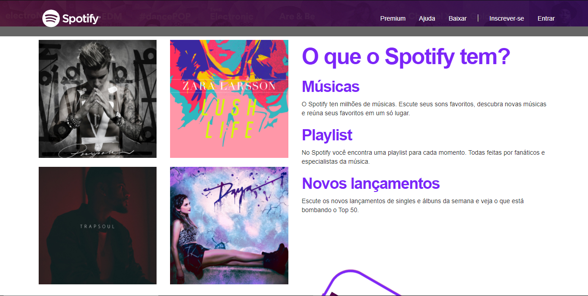
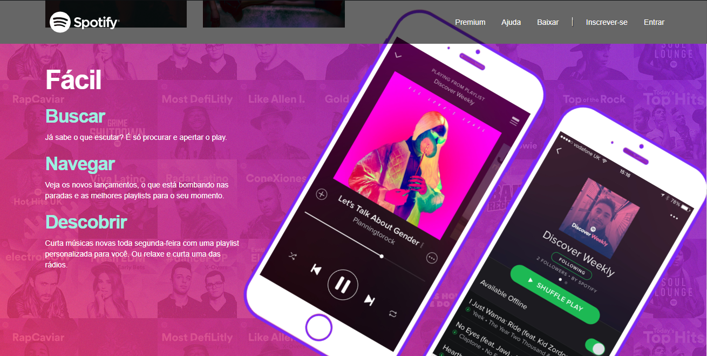
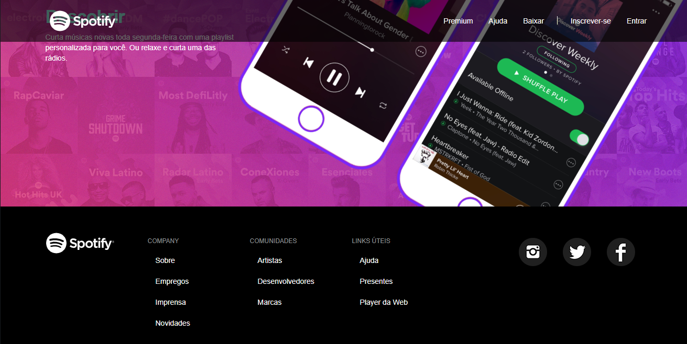

# Spotify-landingpage
 > :rocket: In order to improve my Front End development techinics, I decided to create this clone project from Spotify's main page. 
 

 

## :computer: Web Screenshot

   
 

   
 

## For this project I used:
* HTML5
* CSS3
* Bootstrap

:bulb: Fique à vontade para fazer issues e colaborar no projeto, estou disposto a avaliar pull requests!
